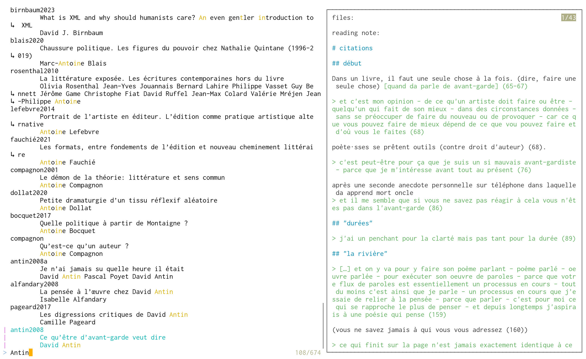
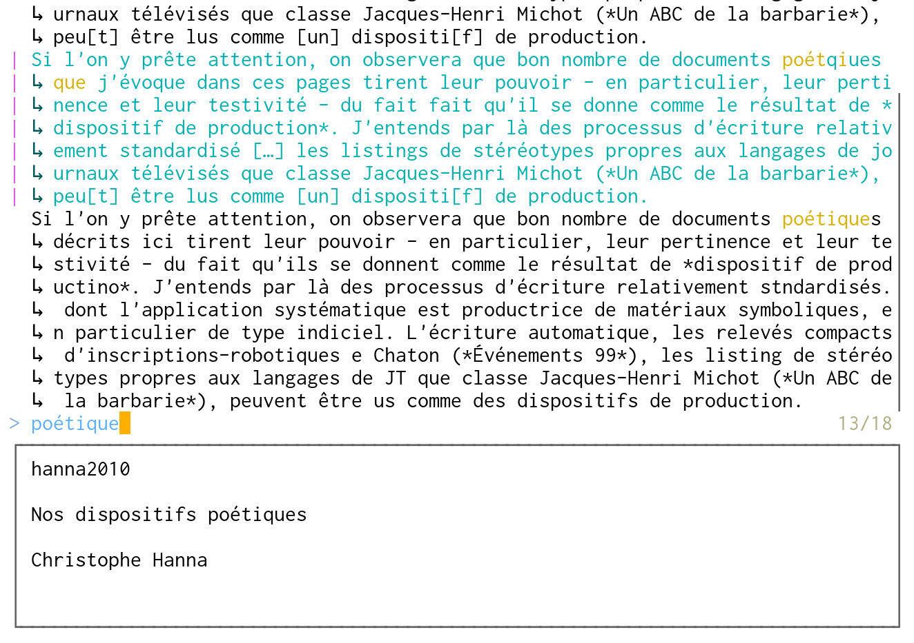
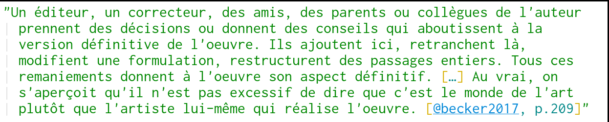
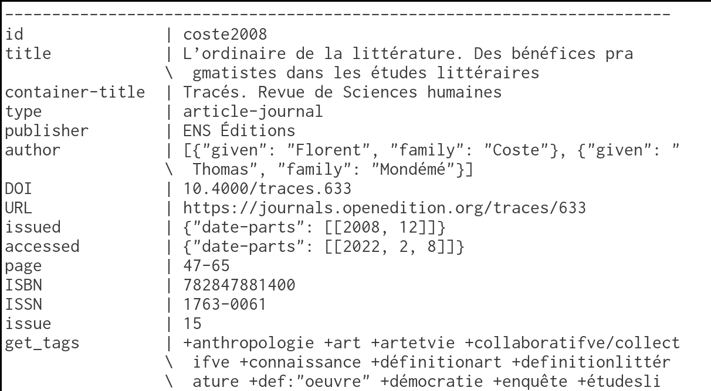

# rétrolire

Command line bibliography management with [fzf](https://github.com/junegunn/fzf) and [PostgreSQL](https://www.postgresql.org/docs/current/index.html).


## Synopsis

```txt
retrolire COMMAND [OPTIONS]
```

| command | description |
| ------- | ----------- |
| [list](#list) | list entries matching criteria. |
| [json](#json) | export entries in csl-json format. |
| [edit](#edit) | edit the reading note attached to an entry. |
| [open](#open) | open a file attached to an entry. |
| [file](#file) | attach a file to an entry. |
| [add](#add) | add one or more bibliography entries. |
| [quote](#quote) | get a quote and its citation. |
| [refer](#refer) | get a concept and its citation. |
| [cite](#cite) | get the id of an entry (citation key). |
| [tag](#tag) | edit tags attached to an entry. |
| [update](#update) | edit the value of a field (title, translator, etc.) for an entry. |
| [print](#print) | print information about entries (all fields, files, notes, tags). |
| [init](#init) | init a database. |
| [delete](#delete) | delete an entry. |

Most commands operate on a single entry (e.g. `edit`, `cite`). Some others show information about many (e.g. `list`). Thus, __rétrolire__ mostly relies upon _selection_ and _filter_ mechanisms. _Filtering_ is done statically through options, while [fzf](https://github.com/junegunn/fzf) is used as the interactive _selection_ (picking) interface.

## options

### filters

Filter options define searching criteria. They are added one to another using the logical operator `AND`. Except for `-l`, they can be used multiple times.

```bash
# Print entries that:
#   - have tags 'poetry' and 'recording'
#   - have been published by 'amsterdam' or 'p.o.l' publisher
retrolire list \
    --tag 'poetry' --tag 'recording' \
    --var 'publisher.amsterdam|p\.o\.l'
```

| option | description | argument |
| ------ | ----------- | -------- |
| `-v` | key-value filter on [csl variables](https://aurimasv.github.io/z2csl/typeMap.xml) | field.[regex](https://www.postgresql.org/docs/current/functions-matching.html#FUNCTIONS-POSIX-REGEXP) |
| `-t` | search in tags | tag |
| `-s` | search a pattern in reading notes | [regex](https://www.postgresql.org/docs/current/functions-matching.html#FUNCTIONS-POSIX-REGEXP) |
| `-q` | search a pattern in quotes | [regex](https://www.postgresql.org/docs/current/functions-matching.html#FUNCTIONS-POSIX-REGEXP) |
| `-c` | search a pattern in concepts | [regex](https://www.postgresql.org/docs/current/functions-matching.html#FUNCTIONS-POSIX-REGEXP) |
| `-l` | select the last edited entry |


### fzf interface

| option | description |
| ------ | ----------- |
| `-e` | no fuzzy matching |
| `-p` | preview pane with information on the entry |
| `-r` | order entries by last editing |
| `-T` | show tags in picking interface |

### misc

| option | description | argument |
| ------ | ----------- | -------- |
| `-?` | show help |
| `-V` | show version |
| `-i` | select an entry by its id | id |

## selection

While filtering through options can use any csl variable (_title_, _translator_, _publisher_, etc.), the selection with [fzf](https://github.com/junegunn/fzf) only uses variables _title_ and _author_ (if an entry has no _author_, then its _editor_ or _translator_).



## commands

Each command can be called by its complete name or by a small part of it (e.g., `ed` for `edit`). All actions (except `init` and `add`) can be used with any options.

### cite

Command `cite` is used to get the __ID__ (citation key) of an entry, for example, to be inserted in a [pandoc](https://pandoc.org/)-markdown document for which footnotes and bibliography will be automatically produced with [citeproc](https://github.com/jgm/citeproc).

```bash
retrolire cite | xclip -selection clipboard
```

### edit

Edit the reading note of an entry with the program defined as the `editor` (in `config.h`).

### quote

Command `quote` outputs a formatted quote.



Unlike `cite`, the whole quote is output (with the citation key).



### open

The `open` action opens a file associated with an entry. By default, [xdg-open](https://linux.die.net/man/1/xdg-open) to define the software to use (depending on the extension), but it can be changed in the config file.

```bash
retrolire open -v 'author.quintane' -v 'publisher.^p\.?o\.?l$'
```
```bash
retrolire open -t '_àlire'
```


### print

The `print` action shows the information of the chosen bibliography entries. (If no filter option is selected, it displays the entire bibliography. Unlike other options that use filters, there is no _selection_ of an entry with fzf: the `json` command displays all entries that match the filters.)

```bash
retrolire print -l
```


### json

The `json` action works like `print`, but the entries are displayed in [csl-json](https://citeproc-js.readthedocs.io/en/last/csl-json/markup.html) format.

```bash
retrolire json -v 'author.(la )?rédaction' -t 'enquête'
```
```json
[
    {
        "id": "larédaction2012",
        "type": "book",
        "title": "Les Berthier: portraits statistiques",
        "author": [{"literal": "La Rédaction"}],
        "issued": {"date-parts": [[2012]]},
        "publisher": "Questions théoriques",
        "title-short": "Les Berthier"
    }
]
```

### update

The `update` action modifies the value of a field (_title_, _publisher_, etc.). It requires an argument (_field_): the field whose value needs to be updated. The second argument (_value_) is optional: if absent, the current value will be opened in the `$EDITOR` to be modified directly; if provided, it is used as the new value.

```bash
# Edit in the `$EDITOR` the current title of the entry 'becker2013'
retrolire update "container-title" -i 'becker2013'
```


### file

The `file` action adds a __file__ to an entry. It takes the file path as an argument.

```bash
# Associate the file './la_maison_de_wittgenstein.pdf' with the entry 'commetti2017'
retrolire add file './la_maison_de_wittgenstein.pdf' -i 'cometti2017'
```

### tag

The `tag` action edits (in the `$EDITOR`) the tags of an entry. It takes an optional argument `pick` that allows selecting (with fzf) tags from the tags already used.

### add

The `add` action adds bibliographic entries from a [bibtex](https://www.bibtex.org/) or [csl-json](https://citeproc-js.readthedocs.io/en/last/csl-json/markup.html) file, or a single one from a [doi](https://dx.doi.org/), an [isbn](https://en.wikipedia.org/wiki/International_Standard_Book_Number), or a template to fill.

It requires two arguments:

- The method: `bibtex` or `json` to import multiple entries from a file, `doi` or `isbn` to retrieve information of an entry from an identifier, or `template` to manually fill values from a file already containing the fields.
- The file (if method is `bibtex` or `json`), or the identifier (if `doi` or `isbn`). It can be left empty if the method is `template`.

```bash
# Import a bibliography in CSL-JSON format
retrolire add json ../found_bibliography.json
```

```bash
# Create a bibtex file from a template
retrolire add template book
```

(The filter options are ignored.)

### init

The `init` action creates a database to store the bibliography. It takes no arguments and no options.

```bash
# (Generally, this command is run only once.)
retrolire init
```

## neovim integration

__rétrolire__ is also a [neovim](https://neovim.io/) plugin. to install it with [lazy](https://github.com/folke/lazy.nvim), add this line to you plugins file:

```lua
{ 'thjbdvlt/retrolire', ft = 'markdown' },
```

Two commands will be available from within [neovim](https://neovim.io/): `Quote` and `Cite`.

## notes parsing

When a reading note is modified (or added), its content is parsed to find and extract __quotes__ and __concepts__.

### quotes

If some __quotes__ are found, they are indexed and put in another table: with the command `quote`, the user can get these quotes (formatted to be put in pandocs-markdown document).

The parsing/extraction requires that the reading note is written in [markdown](https://pandoc.org/chunkedhtml-demo/8-pandocs-markdown.html). Only blockquotes are indexed as quotes. Page number can be precised at the end of the quote, in parentheses or in brackets,:

```markdown
a normal paragraph

> a quote [32]

> another quote (p. 32)

> here too, another quote (32-33)

another normal paragraph
```

### concepts

Reading notes are also parsed in order to find concept definitions (that user can get using `concept` command).
The syntax used is the syntax for [definition list](https://pandoc.org/MANUAL.html#definition-lists) in pandoc markdown, with one difference: a concept may only have one definition.

```markdown

concept
: definition

```

## configuration

The configuration file is [./config.h](./config.h). The software needs to be recompiled (`make && make install`) so the changes can be effective.

## completion (bash)

The completion script (bash) allows for automatic completion of __actions__, __options__, tags, and fields (variables). To use it, source it in the `.bashrc`.

```bash
source ~/.local/share/retrolire/retrolire-completion.bash
```

## installation

__rétrolire__ can be installed by cloning this repository and running the `install.sh` script:

```bash
git clone https://github.com/thjbdvlt/retrolire retrolire
cd retrolire
./install.sh
```

In addition to the executable `retrolire` (installed in /usr/bin), three other executables (python) are installed using [pipx](https://pipx.pypa.io/stable/installation/), if the command is available; otherwise using `pip`.

- `jsonarray2psql`: Converts a _array_ of _objects_ json to a _table_ (PostgreSQL).
- `csljson-update`: Builds unique _ids_ for a csl-json.
- `csl2psql`: Converts a csl-json to a _table_ (PostgreSQL): combines the other two commands (so that the JSON is parsed only once).

## doi / isbn

Retrieving bibliographic references from a [doi](https://dx.doi.org/) or an [isbn](https://en.wikipedia.org/wiki/International_Standard_Book_Number) is done using the program [isbntools](https://pypi.org/project/isbntools/) and [pandoc](https://pandoc.org/)[^p].

[^p]: Rather than directly retrieving the csl-json with `isbn_meta`, it is better to retrieve the bibtex and transform it with pandoc. `author = {Robert Musil}` will be correctly separated into `family` and `given`, whereas with `isbn_meta ... csl`, it would be a `literal` "Robert Musil".

## dependencies

- [PostgreSQL 16](https://www.postgresql.org/docs/current/index.html) and [libpq](https://packages.debian.org/sid/libpq-dev).
- [fzf](https://github.com/junegunn/fzf).

For the importation to the database in the python command line tools:
 
- [psycopg](https://www.psycopg.org/psycopg3/docs/)
- [orjson](https://github.com/ijl/orjson)

To get references from doi/isbn:

- [isbntools](https://pypi.org/project/isbntools/)
- [isbnlib](https://pypi.org/project/isbnlib/)

Correction, structuring, formatting, and conversion from bibtex to csl-json:

- [pandoc](https://pandoc.org/)

## license

License [CC BY-NC-SA 4.0](https://creativecommons.org/licenses/by-nc-sa/4.0/)

## todo / ideas

- [ ] SQLite instead of PostgreSQL.
- [ ] PDF annotations extraction, using [pdfannots](https://github.com/0xabu/pdfannots).
- [ ] Vim plugin (vim script).
